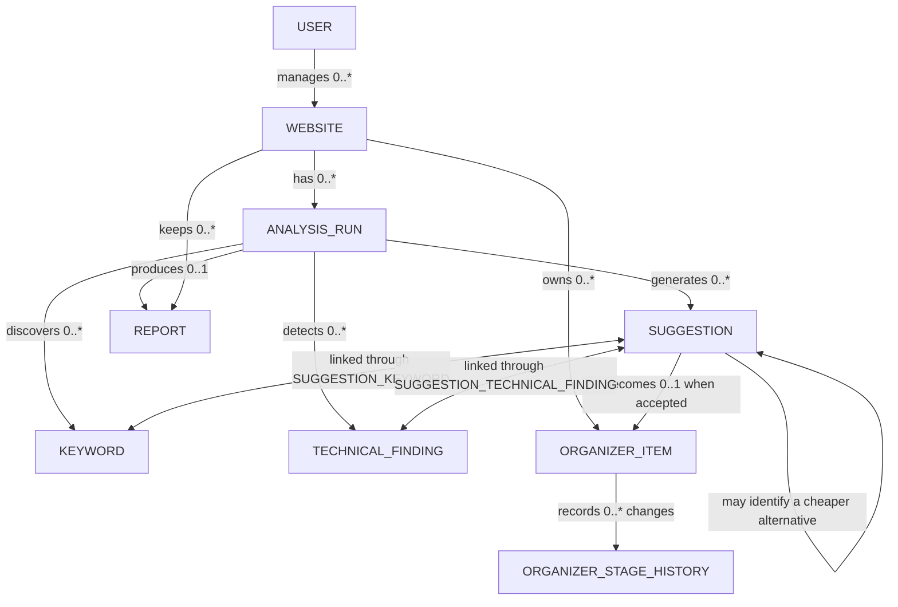

# Trellis MVP Data Model

This document is the written companion to `Trellis_Data_Model.pdf`. It explains what each table stores, how the tables connect, and why those relationships matter.

> Scope: MVP only. Phase 2 and Phase 3 integration tables are intentionally excluded.

## The big picture

Trellis follows this data flow:

1. A **user** manages one or more **websites**.
2. Each website can have many **analysis runs** over time.
3. An analysis run temporarily processes scraped pages and stores **keywords**, **suggestions**, and **technical findings**. It keeps page URLs as evidence, but not raw HTML or permanent page snapshots.
4. A completed analysis run can produce one permanent **report**.
5. When a user accepts a suggestion, it can become an **organizer item**.
6. Trellis records every organizer item's progress in **organizer stage history**.

The model separates scan results from ongoing work. Scan results belong to a particular analysis run, while organizer items belong to the website so they remain available after later scans.

## Relationship vocabulary

| Term | Plain-language meaning |
|---|---|
| **Table** | A collection of related records, similar to one worksheet in a spreadsheet. |
| **Record** | One row in a table, such as one website or one suggestion. |
| **Primary key (PK)** | A field that uniquely identifies a record. In this model, it is usually `id`. |
| **Foreign key (FK)** | A field that points to a record in another table and creates a relationship. |
| **Unique (UQ)** | A rule that prevents duplicate values or duplicate combinations. |
| **Cardinality** | The number of records that may exist on each side of a relationship. |
| `1` | Exactly one. |
| `0..1` | Zero or one; the relationship is optional. |
| `0..*` | Zero, one, or many. |
| **Bridge table** | A table that connects two tables in a many-to-many relationship. |

## Relationship map

## Tables and why they exist

### `users`

Stores each Trellis account.

Important fields include `id`, `name`, `email`, and `created_at`. `id` matches the UUID issued by Supabase Auth, and `email` must be unique. Trellis never stores a password hash itself; Supabase Auth manages credentials securely.

Relationship: one user may manage zero or many websites, but every website belongs to exactly one user.

### `websites`

Stores each business website that a user adds to Trellis, including its URL and business context.

Important fields include `id`, `user_id`, `url`, `business_name`, `business_context`, and `created_at`. The combination of `user_id` and `url` must be unique, preventing one user from adding the same site twice.

Relationships:

- One website may have many analysis runs.
- One website may have many reports across those runs.
- One website may have many organizer items that continue across scans.

### `analysis_runs`

Stores one attempt to scan and evaluate a website at a particular time. Keeping every run makes it possible to compare results over time.

Important fields include `id`, `website_id`, `status`, `pages_scanned_count`, `health_score`, `error_message`, `started_at`, and `completed_at`.

Relationships: one analysis run may produce many keywords, suggestions, and technical findings, but no more than one report.

Scraped HTML and extracted page text exist only while an analysis stage is running. This keeps the database small, avoids retaining unnecessary third-party content, and reduces privacy and security exposure. `pages_scanned_count` records scan breadth; page-specific results keep the relevant URL directly on the suggestion or finding.

### `keywords`

Stores keyword candidates discovered during an analysis run.

Important fields include `id`, `analysis_run_id`, `phrase`, `frequency`, `tfidf_score`, and `search_intent`. The combination of `analysis_run_id` and `phrase` must be unique so the same phrase is not stored twice for one run.

Relationship: an analysis run may discover many keywords. Suggestions and keywords have a many-to-many relationship through `suggestion_keywords`.

### `suggestions`

Stores Trellis recommendations for AEO, SEO/content, and SEM work.

Important fields include the recommendation's category, title, description, starter outline, rationale, priority, acceptance status, dismissal reason, and optional `affected_page_url`. SEM-only fields store cost tier, ad-group guidance, ad-copy direction, landing-page fit, targeting notes, and negative keywords.

Relationships:

- Every suggestion belongs to one analysis run.
- A suggestion may optionally identify one affected page URL.
- A suggestion may target many keywords through `suggestion_keywords`.
- A suggestion may address many technical findings through `suggestion_technical_finding`.
- An accepted suggestion may create one organizer item.
- A lower-cost SEM suggestion may point to the more expensive suggestion it replaces through `cheaper_alternative_to_id`.

### `suggestion_keywords`

This bridge table connects suggestions and keywords. It is needed because one suggestion can target several keywords, and one keyword can support several suggestions.

Its combined primary key is `suggestion_id` plus `keyword_id`, which prevents the same suggestion-keyword pair from being added twice. `recommended_usage_count` stores how many times Trellis recommends using the keyword.

### `technical_findings`

Stores technical SEO problems found during an analysis run.

Important fields include `finding_type`, `severity`, `explanation`, `affected_page_url`, `related_page_url`, `resolution_status`, `resolved_at`, and `created_at`.

A finding may be:

- **Sitewide:** both page URL fields are empty.
- **Page-specific:** `affected_page_url` identifies the page.
- **A comparison:** `affected_page_url` and `related_page_url` identify the two pages.

One finding may support many suggestions, and one suggestion may address many findings. The `suggestion_technical_finding` bridge table represents that connection.

### `suggestion_technical_finding`

This bridge table connects suggestions and technical findings. Its combined primary key is `suggestion_id` plus `technical_finding_id`, preventing duplicate pairs.

Example: a slow page and missing metadata could both support one "improve this page" suggestion, while one technical issue could lead to several possible suggestions.

### `reports`

Stores a permanent summary of one completed analysis run. Reports are snapshots: an old report must not be recalculated when scoring logic changes.

Important fields include the Health Score and its change, AEO completion and its change, technical-finding counts, published-content counts, top keywords, SEM counts, organizer stage counts, summary, and generation time.

Relationships:

- An analysis run may have zero or one report. `analysis_run_id` is unique, which prevents a second report for the same run.
- A website may have many reports, creating a history that can be compared over time.

### `organizer_items`

Stores ongoing work that the user has chosen to track. It belongs directly to the website so it survives future analysis runs.

Important fields include `website_id`, `suggestion_id`, `item_type`, `title`, `stage`, `due_date`, `created_at`, `updated_at`, and `published_at`.

Relationship: one accepted suggestion may create zero or one organizer item. Because `suggestion_id` is unique, the same suggestion cannot create two tasks.

### `organizer_stage_history`

Stores a dated record whenever an organizer item moves from one stage to another. This allows Trellis to show how work progressed rather than only its current stage.

Important fields include `organizer_item_id`, `from_stage`, `to_stage`, and `changed_at`.

Relationship: one organizer item may have zero or many stage-history records; every history record belongs to exactly one organizer item.

## Complete relationship reference

| Parent | Child | Cardinality | Foreign key or constraint | What it means |
|---|---|---:|---|---|
| `users` | `websites` | 1 to 0..* | `websites.user_id -> users.id` | A user may manage many websites; every website has one user. |
| `websites` | `analysis_runs` | 1 to 0..* | `analysis_runs.website_id -> websites.id` | A website may be scanned many times; every run belongs to one website. |
| `analysis_runs` | `keywords` | 1 to 0..* | `keywords.analysis_run_id -> analysis_runs.id` | One run may discover many keyword candidates. |
| `analysis_runs` | `suggestions` | 1 to 0..* | `suggestions.analysis_run_id -> analysis_runs.id` | One run may generate many AEO, SEO/content, and SEM suggestions. |
| `analysis_runs` | `technical_findings` | 1 to 0..* | `technical_findings.analysis_run_id -> analysis_runs.id` | One run may detect many technical issues. |
| `analysis_runs` | `reports` | 1 to 0..1 | `reports.analysis_run_id` is an FK and unique | A completed run gets one permanent report; an unfinished run may have none. |
| `websites` | `reports` | 1 to 0..* | `reports.website_id -> websites.id` | A website keeps report history across all runs. |
| `websites` | `organizer_items` | 1 to 0..* | `organizer_items.website_id -> websites.id` | A website owns one ongoing task pipeline across multiple scans. |
| `suggestions` | `organizer_items` | 1 to 0..1 | `organizer_items.suggestion_id` is an FK and unique | An accepted suggestion may create one task; a task has one source suggestion. |
| `organizer_items` | `organizer_stage_history` | 1 to 0..* | `organizer_stage_history.organizer_item_id -> organizer_items.id` | Every task can record many stage changes over time. |
| `suggestions` + `keywords` | `suggestion_keywords` | many to many | Composite PK: `suggestion_id` + `keyword_id` | A suggestion can target many keywords; a keyword can support many suggestions. |
| `suggestions` + `technical_findings` | `suggestion_technical_finding` | many to many | Composite PK: `suggestion_id` + `technical_finding_id` | A suggestion can address many findings and vice versa. |
| `suggestions` | `suggestions` | 1 to 0..* | `cheaper_alternative_to_id` is a nullable self-FK | A lower-cost SEM suggestion can point to the expensive suggestion it replaces. |

## Rules the application must enforce

1. Keep `suggestions.acceptance_status` separate from `organizer_items.stage`. Accepting a recommendation is not the same as completing the resulting work.
2. Valid acceptance statuses are `pending`, `accepted`, and `dismissed`.
3. Valid Organizer stages are `backlog`, `in_production`, `in_review`, and `published`. `organizer_items.stage` is the only stored task stage. Set `published_at` when work enters `published`.
4. Valid suggestion categories are `aeo`, `seo_content`, and `sem`. Cost and advertising fields remain empty unless the category is `sem`.
5. Valid dismissal reasons are `not_relevant`, `too_much_work`, `already_doing_this`, and `other`. A reason is required only when a suggestion is dismissed.
6. Constrain `health_score` to an integer from 0 through 100.
7. Preserve reports as historical snapshots. Comparisons should use two stored reports.
8. Preserve organizer work across later scans by attaching it to the website; retain its source suggestion to show where the work originated.

## Unique data rules

- `users.email`
- `websites (user_id, url)`
- `keywords (analysis_run_id, phrase)`
- `reports.analysis_run_id`
- `organizer_items.suggestion_id`

These rules protect data quality by preventing duplicate accounts, websites, per-run keywords, reports, and suggestion-created tasks.

## Example journey through the model

Suppose a user adds `example.com` and starts a scan:

1. Trellis creates one row in `websites` for `example.com`.
2. It creates a new row in `analysis_runs` for that scan.
3. Trellis processes each page temporarily, then discards its raw HTML and extracted text.
4. Discovered phrases become `keywords` rows.
5. Problems such as missing metadata become `technical_findings` rows with the affected page URL.
6. Recommended improvements become `suggestions` rows with an affected page URL when applicable.
7. Bridge-table rows connect each suggestion to its supporting keywords and technical findings.
8. When the run finishes, Trellis creates one `reports` row.
9. If the user accepts a suggestion, Trellis may create one `organizer_items` row whose `item_type` is AEO, SEO/content, or SEM.
10. As the task moves from backlog to published, its one canonical stage changes and each change becomes an `organizer_stage_history` row.

That structure lets Trellis explain where a recommendation came from, manage the resulting work, and measure improvement across later scans.
